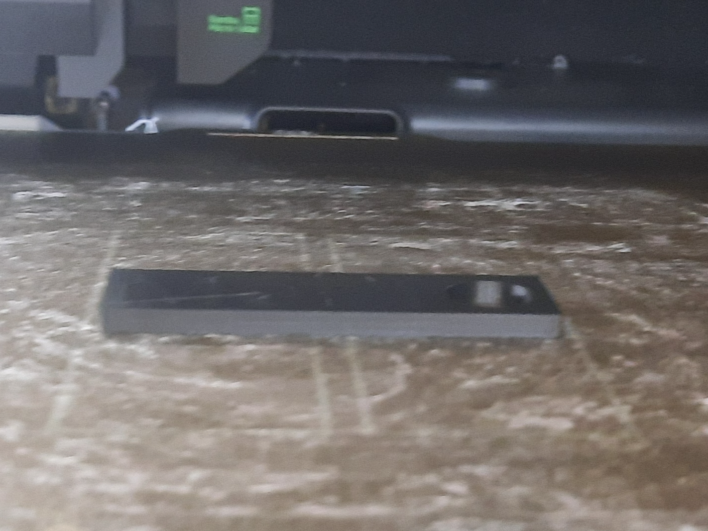

# Meril Keychain

A custom 3D-printed name keychain designed in CAD and exported as an STL file for additive manufacturing.

## Files

- `Meril_keychain.stl` - Ready-to-print STL model
- `preview.png` – Preview image

## Tested Print Settings

Material: PLA
Layer Height: 0.20 mm
Infill: 15%
Nozzle: 0.4 mm

Successfully printed on Bambu Labs printer.